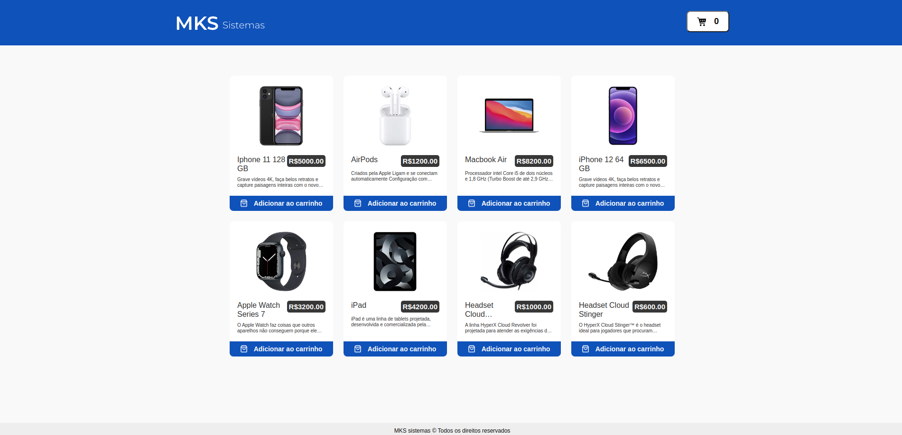

<a name="readme-top"></a>

<br />
<div align="center">
  <h3 align="center">MKS E-commerce</h3>

  <p align="center">
    An awesome E-commerce made with React.js!
    <br />
    <a href="https://mks-ecommerce-bice.vercel.app/"><strong>Explore the App »</strong></a>
    <br />
    <br />
    <a href="https://mks-ecommerce-bice.vercel.app/">View Demo</a>
    ·
    <a href="https://github.com/sudo-victor/mks-ecommerce/issues">Report Bug</a>
    ·
    <a href="https://github.com/sudo-victor/mks-ecommerce/issues">Request Feature</a>
  </p>
</div>

<!-- ABOUT THE PROJECT -->
## About The Project


<a href="https://project-mks-ivory.vercel.app/">
  
</a>


<p align="right">(<a href="#readme-top">back to top</a>)</p>


### Built With

* [![Typescript][Typescript]][Typescript-url]
* [![React][React.js]][React-url]
* [![Styled-Components][Styled-Components]][Styled-Components-url]
* [![Redux][Redux]][Redux-url]

<p align="right">(<a href="#readme-top">back to top</a>)</p>


<!-- GETTING STARTED -->
## Getting Started

### Installation

1. Clone the repo
   ```sh
   git clone https://github.com/leandro-miranda/Project-MKS-Frontend-challenge
   ```
2. Install NPM packages
   ```sh
   npm install
   or
   yarn
   ```

### Run

```sh
npm run dev
or
yarn dev
```

<p align="right">(<a href="#readme-top">back to top</a>)</p>


<!-- LICENSE -->
## License

Distributed under the MIT License. See `LICENSE.txt` for more information.

<p align="right">(<a href="#readme-top">back to top</a>)</p>

